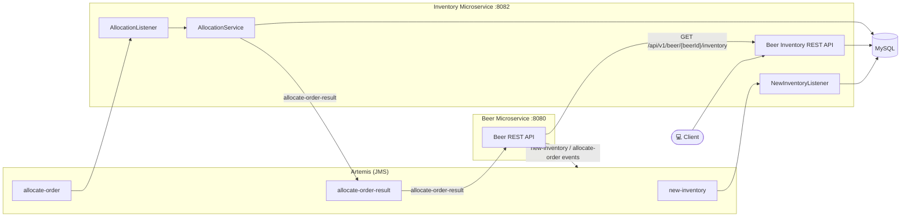

# SFG Beer Works - Brewery Inventory Microservice

This project is the inventory microservice of the KBE brewery: a Spring Boot 4 (Spring Framework 6, Java 25)
REST API (Spring Web MVC) for beer inventory, backed by MySQL (JPA) and Artemis (JMS), and consumed by the
beer service (`kbe-brewery-beer-micro-service`). It is deployed via Docker Compose (local) and Kubernetes (Helm).

See Gateway Project for Detailed description:
https://github.com/dboeckli/kbe-brewery-gateway/blob/master/README.md

Original git repository: https://github.com/springframeworkguru/kbe-sb-microservices.git

## Architecture Overview



### Role of the services

**kbe-brewery-inventory-micro-service** (:8082) — the primary beer inventory source of the KBE
brewery. It exposes a REST API (Spring Web MVC) that the beer microservice calls via RestClient to
read the current inventory for a beer (`GET /api/v1/beer/{beerId}/inventory`,
`BeerInventoryController`). Inventory data is stored in MySQL (JPA, `BeerInventoryRepository`).

The service is also a JMS consumer/producer on Artemis:

- `NewInventoryListener` consumes `new-inventory` events (published by the beer microservice when a
  beer is brewed) and persists the new quantity on hand (`NewInventoryListener.listen`).
- `AllocationListener` consumes `allocate-order` events, delegates to `AllocationService` (full /
  partial allocation against the stored inventory) and publishes the result back to the
  `allocate-order-result` queue (`AllocationListener.listen`).

On startup, `BeerInventoryBootstrap` seeds three beers with initial stock when the table is empty.

## Deployment with Helm

Deployment is Helm-only: chart in `helm-charts/` (packaged as `kbe-brewery-inventory-micro-service-chart`),
namespace `kbe-brewery-inventory-micro-service`.

To run maven filtering for destination target/helm

```bash
./mvnw clean install -DskipTests
```

Go to the directory where the tgz file has been created after 'mvn install'

```powershell
cd target/helm/repo
```

unpack

```powershell
$file = Get-ChildItem -Filter kbe-brewery-inventory-micro-service-chart-*.tgz | Select-Object -First 1
tar -xvf $file.Name
```

install

```powershell
$APPLICATION_NAME = Get-ChildItem -Directory | Where-Object { $_.LastWriteTime -ge $file.LastWriteTime } | Select-Object -ExpandProperty Name
helm upgrade --install $APPLICATION_NAME ./$APPLICATION_NAME --namespace kbe-brewery-inventory-micro-service --create-namespace --wait --timeout 8m --debug --render-subchart-notes
```

show logs

```powershell
kubectl get pods -l app.kubernetes.io/name=kbe-brewery-inventory-micro-service -n kbe-brewery-inventory-micro-service
```

replace $POD with pods from the command above

```powershell
kubectl logs $POD -n kbe-brewery-inventory-micro-service --all-containers
```

test

```powershell
helm test $APPLICATION_NAME --namespace kbe-brewery-inventory-micro-service --logs
```

uninstall

```powershell
helm uninstall $APPLICATION_NAME --namespace kbe-brewery-inventory-micro-service
```

delete all

```powershell
kubectl delete all --all -n kbe-brewery-inventory-micro-service
```

create busybox sidecar

```powershell
kubectl run busybox-test --rm -it --image=busybox:1.37.0 --namespace=kbe-brewery-inventory-micro-service --command -- sh
```

You can use the actuator rest call to verify via port 30082

## Sandbox (local dev environment)

The sandbox consists of the app (Spring Boot, port 8082) plus MySQL and Artemis (JMS), provided by
`compose.yaml`. The services start automatically via `spring.docker.compose.enabled=true` when the app
boots, so usually one step is enough.

### Start the sandbox (opencode-sandbox-kit)

The sandbox is provisioned by the opencode-sandbox-kit and runs as a Docker container. It mounts this
repo, starts opencode, and connects the IntelliJ MCP server.

Allow the kit source (GitHub without cloning):

```powershell
sbx settings set kit.allowedSources --% "[\"docker.io/\",\"github.com/dboeckli/\"]"
```

Start a new sandbox:

```powershell
sbx run opencode --name kbe-brewery-inventory-micro-service --kit "git+https://github.com/dboeckli/opencode-sandbox-kit.git#dir=opencode-agent" "C:\development\projects\kbe-brewery-inventory-micro-service"
```

Start the sandbox with Kubernetes support:

```powershell
sbx run opencode --name kbe-brewery-inventory-micro-service --kit "git+https://github.com/dboeckli/opencode-sandbox-kit.git#dir=opencode-agent" "C:\development\projects\kbe-brewery-inventory-micro-service" "$env:USERPROFILE\.kube:ro"
```

Apply the kit to an existing sandbox (restarts the sandbox, VM state is kept):

```powershell
sbx kit add kbe-brewery-inventory-micro-service "git+https://github.com/dboeckli/opencode-sandbox-kit.git#dir=opencode-agent"
```

### Start the app

Run the `InventoryServiceApplication` run configuration in IntelliJ
(`.run/InventoryServiceApplication.run.xml`, main class
`ch.dboeckli.springframeworkguru.kbe.inventory.services.InventoryServiceApplication`). Alternatively
start via `./mvnw spring-boot:run`.

The compose file brings up:

- `mysql` (port 3306) — database `beerservice`
- `jms` (ports 61616/8161) — Artemis broker + console

### Verify

- Actuator health: http://localhost:8082/actuator/health
- Artemis console: http://localhost:8161/console

## Contributing

Contributions to improve this template are welcome. Please follow the standard GitHub flow:
1. Fork the repository
2. Create a feature branch
3. Commit your changes
4. Push to the branch
5. Create a new Pull Request
